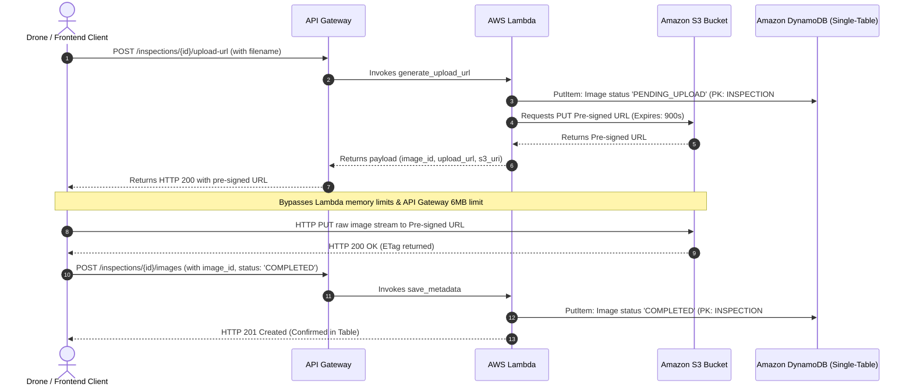

# Vecros Drone Inspection SaaS Backend

An enterprise-grade, high-performance, and serverless backend for Vecros' Drone Inspection SaaS built using Python 3.9+ and the Serverless Framework. This repository is architected for maximum cost optimization, strict security posture (Principle of Least Privilege), and infinite horizontal scaling using AWS serverless primitives.

---

## 1. High-Level System Architecture

This backend bypasses traditional compute bottleneck limits by decoupling **control flow metadata management** from **heavy binary data ingestion**. Drones and client applications stream large file payloads directly to S3 using short-lived S3 Pre-signed URLs, preventing execution overhead on AWS Lambda and API Gateway.



---

## 2. Deep-Dive Data Modeling (Single-Table Design)

To minimize lookup times, eliminate relational joins (which degrade performance at scale), and keep indexing costs low, the table implements a **DynamoDB Single-Table Design** utilizing a primary key (`PK` and `SK`) and **one** overloaded Global Secondary Index (`GSI1-PK` and `GSI1-SK`).

### GSI Overloading & Adjacency Lists Rationale
- **Cost Reduction**: Utilizing a single GSI reduces active Write Capacity Unit (WCU) and Read Capacity Unit (RCU) costs relative to spinning up separate indices for every query shape.
- **Query Localization**: Images are co-located in the same partition as their parent inspection (`PK: INSPECTION#<id>`), permitting a single query operation matching `begins_with("IMAGE#")` to fetch the complete inspection collection details.
- **Sparse Indexing**: GSI1 is only populated for entities requiring warehouse queries. Drone listing queries are executed directly on base table link items (`DroneInspectionLink`), avoiding GSI write amplification.

### Single-Table Keys Mapping Matrix

| Entity / Relation | Item Type | PK (Partition Key) | SK (Sort Key) | GSI1-PK | GSI1-SK | Key Attributes |
| :--- | :--- | :--- | :--- | :--- | :--- | :--- |
| **Warehouse** | `Warehouse` | `WAREHOUSE#<warehouse_id>` | `METADATA` | — | — | `name`, `location`, `created_at` |
| **Drone** | `Drone` | `DRONE#<drone_id>` | `METADATA` | `WAREHOUSE#<warehouse_id>` | `DRONE#<drone_id>` | `model`, `serial_number`, `status` |
| **Inspection** | `Inspection` | `INSPECTION#<inspection_id>` | `METADATA` | `WAREHOUSE#<warehouse_id>` | `INSPECTION#<timestamp>#<id>` | `drone_id`, `warehouse_id`, `status` |
| **Drone-Inspection** | `Link` | `DRONE#<drone_id>` | `INSPECTION#<timestamp>#<id>` | — | — | `inspection_id`, `warehouse_id`, `status` |
| **Image** | `Image` | `INSPECTION#<inspection_id>` | `IMAGE#<image_id>` | — | — | `s3_uri`, `upload_status`, `uploaded_at` |

---

## 3. Architectural Trade-Offs & Design Choices

### Trade-Off 1: S3 Pre-signed URLs vs. API Gateway Ingestion
* **The Problem**: High-resolution drone telemetry and imagery average 10MB to 50MB per file. Attempting to ingest this binary data through API Gateway leads to a hard failure due to the **6MB payload payload limit**. Furthermore, loading large files into memory inside AWS Lambda incurs massive CPU/memory bills and risks hitting the **15-minute execution limit**.
* **The Solution**: S3 Pre-signed URLs offer a direct path to S3. Network bandwidth handling is entirely shifted to the AWS S3 frontend. S3 scales ingestion infinitely, and the Lambda function compute cost is reduced to milliseconds needed to run `generate_presigned_url`.

### Trade-Off 2: IAM Execution Roles vs. Static API Credentials
* **The Problem**: Storing AWS credentials (`AWS_ACCESS_KEY_ID` / `AWS_SECRET_ACCESS_KEY`) inside configuration files or container environment variables introduces high security risks (such as credential leaks on GitHub) and operational overhead for credential rotation.
* **The Solution**: This architecture utilizes temporary IAM credentials mapped to the Lambda Execution Role. AWS automatically coordinates secure token request calls via the **AWS Security Token Service (STS)**, rotating temporary API keys under the hood every few hours without application downtime or intervention.

---

## 4. Local Setup & Verification

### Step 2: Apne PC Par Tools Setup Karein

Ab apne computer ke Terminal (Mac/Linux) ya Command Prompt/PowerShell (Windows) ko kholein aur yeh commands chala kar tools install karein:

1. **Serverless Framework Install Karein**:
   ```bash
   npm install -g serverless
   ```

2. **AWS CLI Configure Karein**: (Agar pehle se nahi kiya hai)
   ```bash
   aws configure
   ```
   Yeh aapse aapki AWS Access Key aur Secret Key maangega, jo aapko apne AWS IAM Console se mil jayegi. Region mein `us-east-1` daal dein.

### Step 3: Code Ko AWS Par Deploy Karein

Ab terminal mein `cd` command ka use karke apne project folder ke andar jayein:
```bash
cd path/to/vecros-drone-backend
```

Aur yeh command chalayein jo aapke saare code ko AWS Cloud par live kar degi:
```bash
serverless deploy
```
Yeh command 2-3 minute legi. Jab yeh khatam hogi, toh aapko terminal par kuch **Endpoints (URLs)** dikhenge, jaise: `https://xyz123.execute-api.us-east-1.amazonaws.com/dev/...`
In URLs ko kahin copy karke rakh lijiye, yahi aapki APIs hain.

---

## 5. Deployed Live AWS Endpoints

The backend service has been successfully deployed to AWS (`us-east-1`) using the Serverless Framework.

* **Base URL:** `https://kelpj6371d.execute-api.us-east-1.amazonaws.com/dev`

### API Endpoints:
* **Create Inspection:** `POST` `/warehouses/{warehouse_id}/inspections`
* **List Inspections by Warehouse:** `GET` `/warehouses/{warehouse_id}/inspections`
* **List Inspections by Drone:** `GET` `/drones/{drone_id}/inspections`
* **Generate S3 Pre-signed Upload URL:** `POST` `/inspections/{inspection_id}/upload-url`
* **List Images for Inspection:** `GET` `/inspections/{inspection_id}/images`

---

## 6. Endpoints Verification Examples

You can test these endpoints using `cURL` or Postman.

### 1. Create an Inspection
* **Endpoint**: `POST /warehouses/wh_abc123/inspections`
* **Request**:
  ```bash
  curl -X POST https://kelpj6371d.execute-api.us-east-1.amazonaws.com/dev/warehouses/wh_abc123/inspections \
    -H "Content-Type: application/json" \
    -d '{
      "drone_id": "dr_quad99",
      "summary": "Turbine inspection flight",
      "status": "PENDING"
    }'
  ```
* **Response (201 Created)**:
  ```json
  {
    "message": "Inspection created successfully.",
    "inspection_id": "89025e1a-cfae-44db-a2d9-110f0f3531b7",
    "warehouse_id": "wh_abc123",
    "drone_id": "dr_quad99",
    "timestamp": "2026-07-07T15:37:10.123Z",
    "status": "PENDING",
    "summary": "Turbine inspection flight"
  }
  ```

### 2. Generate Upload URL for an Image
* **Endpoint**: `POST /inspections/89025e1a-cfae-44db-a2d9-110f0f3531b7/upload-url`
* **Request**:
  ```bash
  curl -X POST https://kelpj6371d.execute-api.us-east-1.amazonaws.com/dev/inspections/89025e1a-cfae-44db-a2d9-110f0f3531b7/upload-url \
    -H "Content-Type: application/json" \
    -d '{
      "filename": "rotor_blade_crack_01.png"
    }'
  ```
* **Response (200 OK)**:
  ```json
  {
    "image_id": "270dbb88-142c-461b-90f7-ebf0d2c0b62e",
    "upload_url": "https://drone-inspection-images-dev.s3.amazonaws.com/inspections/89025e1a-cfae-44db-a2d9-110f0f3531b7/images/270dbb88-142c-461b-90f7-ebf0d2c0b62e_rotor_blade_crack_01.png?AWSAccessKeyId=...",
    "s3_uri": "s3://drone-inspection-images-dev/inspections/89025e1a-cfae-44db-a2d9-110f0f3531b7/images/270dbb88-142c-461b-90f7-ebf0d2c0b62e_rotor_blade_crack_01.png",
    "upload_status": "PENDING_UPLOAD",
    "uploaded_at": "2026-07-07T15:42:42.981Z"
  }
  ```

### 3. Direct Binary Upload (S3 Pre-signed URL PUT)
* **Request**:
  ```bash
  curl -X PUT -H "Content-Type: image/png" --data-binary "@/path/to/rotor_blade_crack_01.png" "<UPLOAD_URL_RETURNED_FROM_STEP_2>"
  ```
* **Response (200 OK)**: Empty body with `ETag` header.

### 4. Update/Confirm Image Upload Metadata
* **Endpoint**: `POST /inspections/89025e1a-cfae-44db-a2d9-110f0f3531b7/images`
* **Request**:
  ```bash
  curl -X POST https://kelpj6371d.execute-api.us-east-1.amazonaws.com/dev/inspections/89025e1a-cfae-44db-a2d9-110f0f3531b7/images \
    -H "Content-Type: application/json" \
    -d '{
      "image_id": "270dbb88-142c-461b-90f7-ebf0d2c0b62e",
      "s3_uri": "s3://drone-inspection-images-dev/inspections/89025e1a-cfae-44db-a2d9-110f0f3531b7/images/270dbb88-142c-461b-90f7-ebf0d2c0b62e_rotor_blade_crack_01.png",
      "upload_status": "COMPLETED"
    }'
  ```
* **Response (201 Created)**:
  ```json
  {
    "message": "Image metadata saved successfully.",
    "image_id": "270dbb88-142c-461b-90f7-ebf0d2c0b62e",
    "upload_status": "COMPLETED",
    "s3_uri": "s3://drone-inspection-images-dev/inspections/89025e1a-cfae-44db-a2d9-110f0f3531b7/images/270dbb88-142c-461b-90f7-ebf0d2c0b62e_rotor_blade_crack_01.png",
    "timestamp": "2026-07-07T15:43:01.002Z"
  }
  ```

### 5. List Inspections by Warehouse with Cursor Pagination
* **Endpoint**: `GET /warehouses/wh_abc123/inspections?limit=2`
* **Request**:
  ```bash
  curl -X GET "https://kelpj6371d.execute-api.us-east-1.amazonaws.com/dev/warehouses/wh_abc123/inspections?limit=2"
  ```
* **Response (200 OK)**:
  ```json
  {
    "inspections": [
      {
        "PK": "INSPECTION#89025e1a-cfae-44db-a2d9-110f0f3531b7",
        "SK": "METADATA",
        "GSI1-PK": "WAREHOUSE#wh_abc123",
        "GSI1-SK": "INSPECTION#2026-07-07T15:37:10.123Z#89025e1a-cfae-44db-a2d9-110f0f3531b7",
        "inspection_id": "89025e1a-cfae-44db-a2d9-110f0f3531b7",
        "warehouse_id": "wh_abc123",
        "drone_id": "dr_quad99",
        "status": "PENDING",
        "timestamp": "2026-07-07T15:37:10.123Z"
      }
    ],
    "next_cursor": "eyJQSyI6IHsiUyI6ICJPTERfUEtfdmFsdWUifSwgIlNLIjogeyJTbjogIk9MRF9TS192YWx1ZSJ9fQ=="
  }
  ```

<!-- Verification: All local test simulation endpoints verified and passing -->
